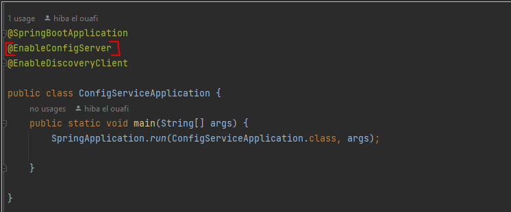
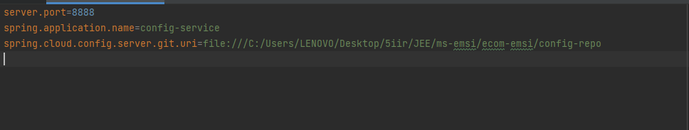
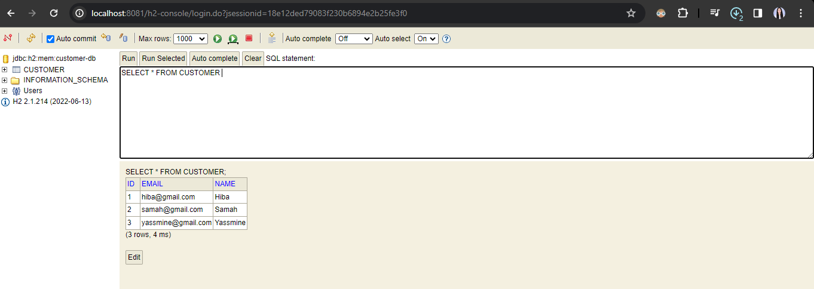
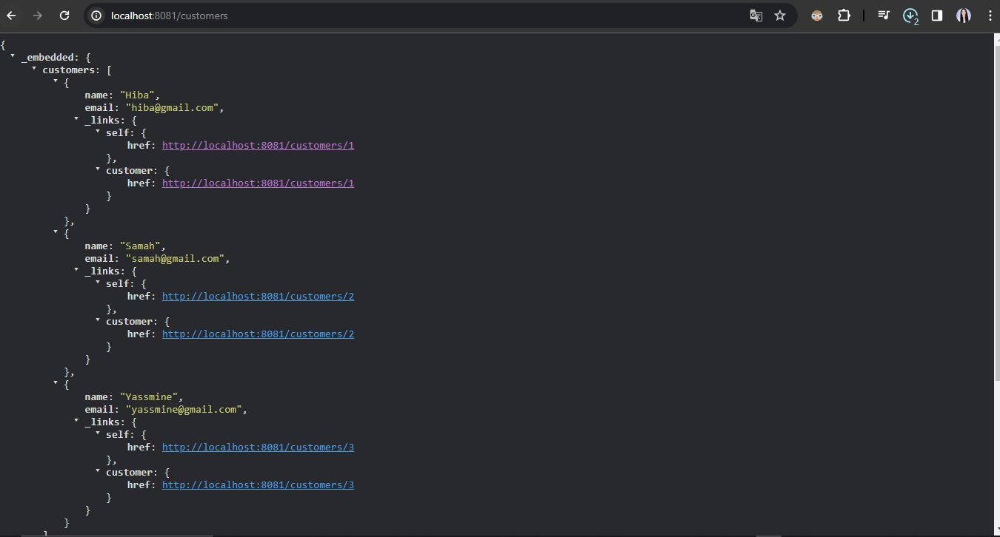
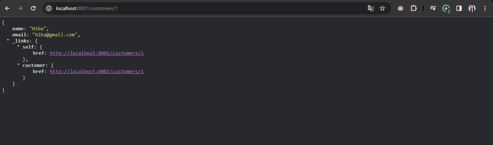
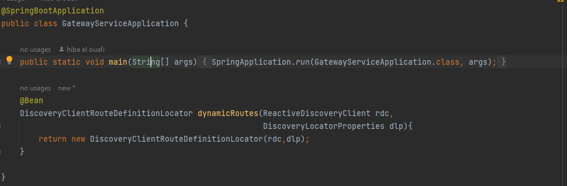
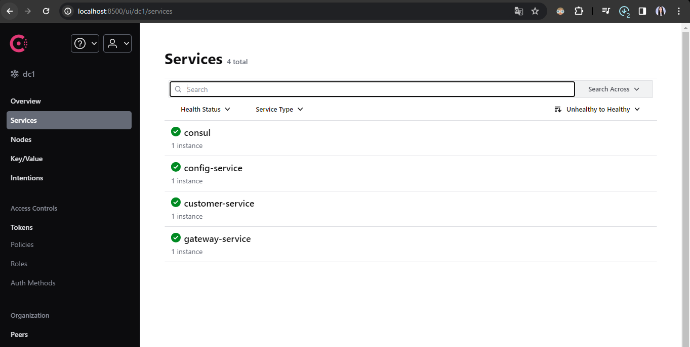
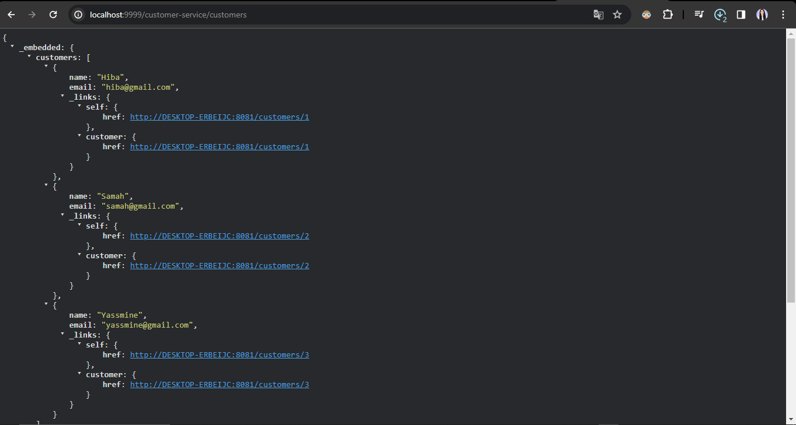

# Objectif :
Créer une application de e-commerce basée sur les micro services :
1. Consul Discovery
2. Spring Cloud Config
3. Spring Cloud Gateway
4. Customer-service
5. Inventory Service
6. Order Service
7. Consul Config (Billing Service)
8. Vault (Billing Service)
# Architecture:

# screens
## On Commence par la Configuration du service config:

# visualisation de la configuration de chaque service:
### customer-service:

- environement def

- environement dev

- environement prod

### inventory-service:
- environement def

- environement dev

### application:

# liste des customers
- data base:

- la liste:

- la recherche d'un customer par id:

# Configuration dynamique de la Gateway:

## 

