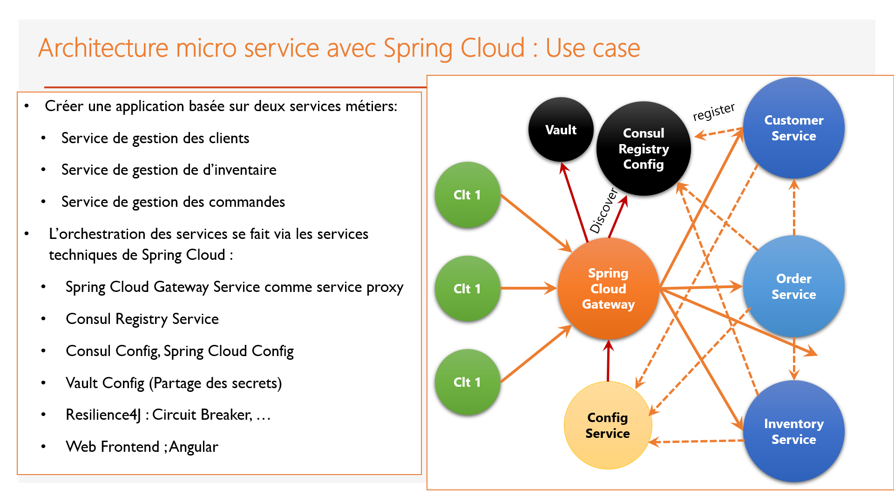
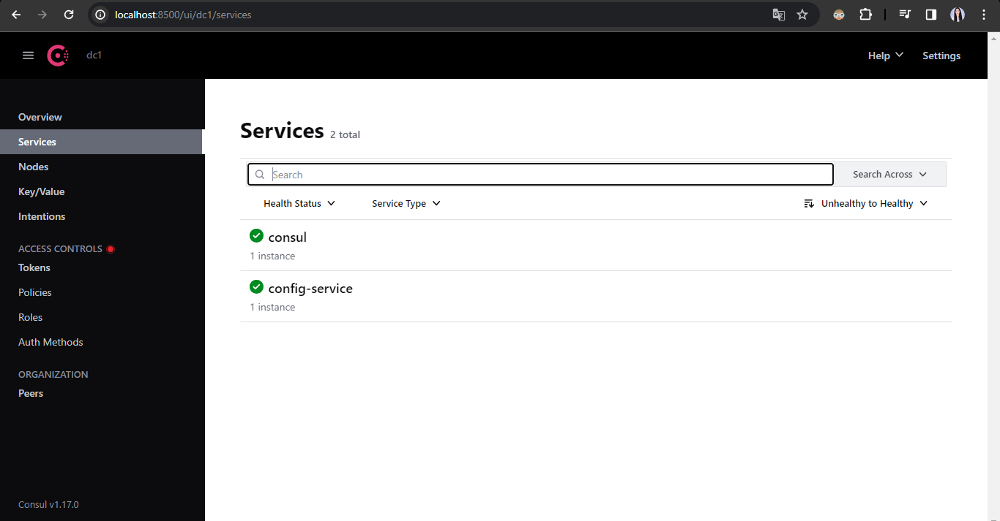
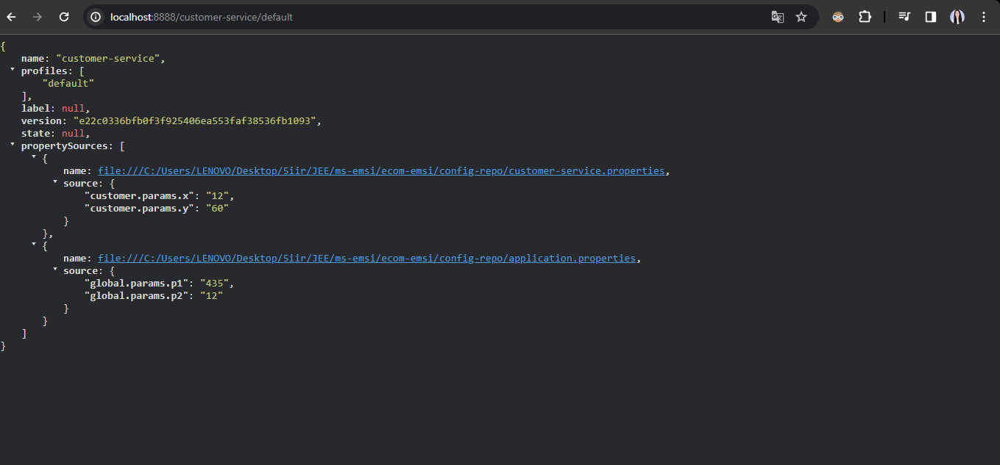
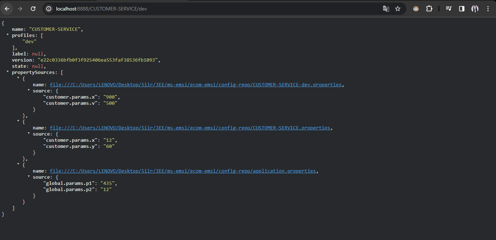
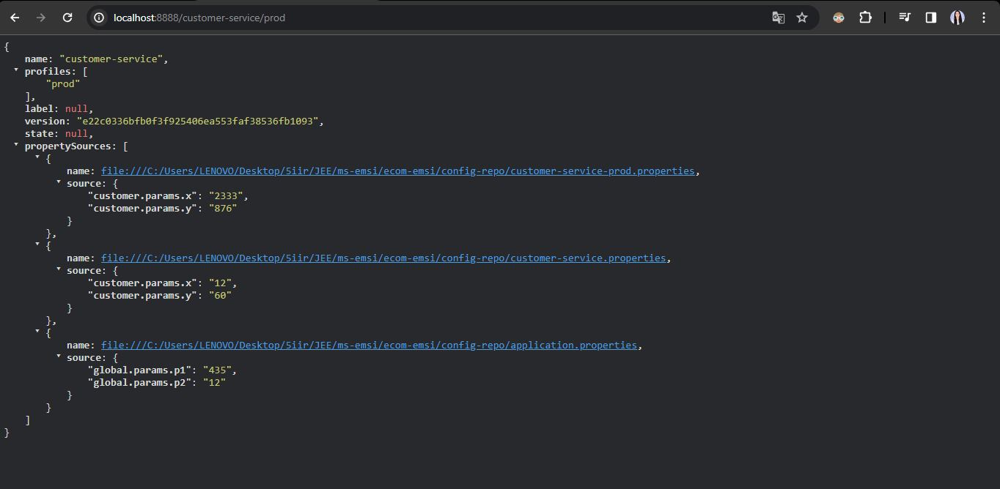
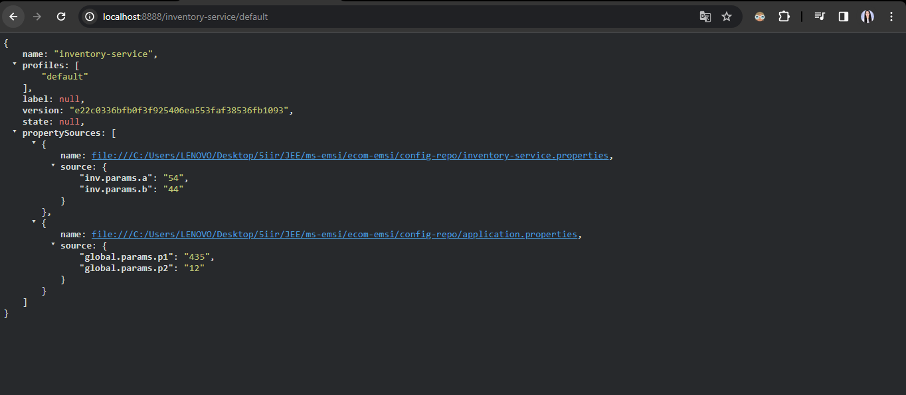
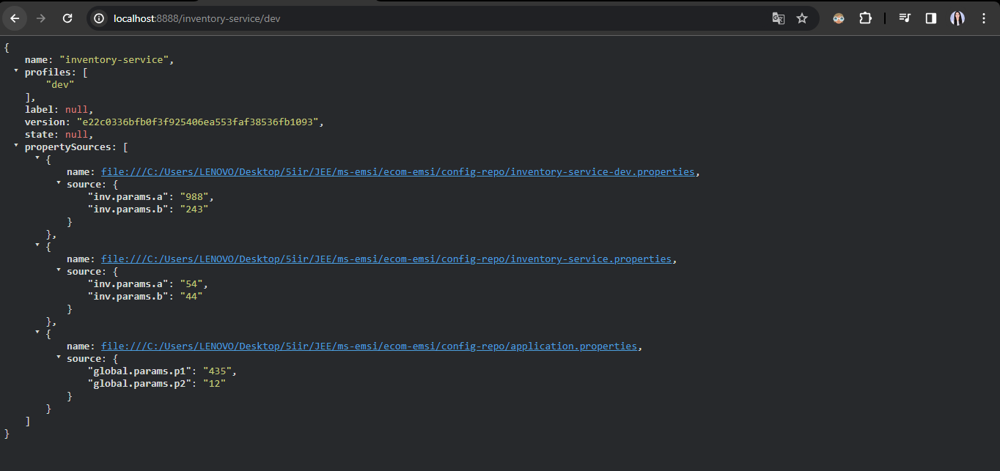
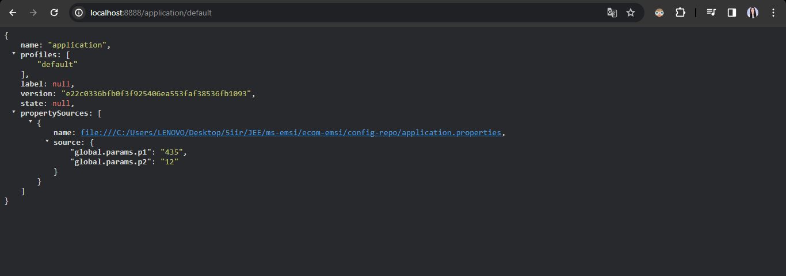

# Objectif :
Créer une application de e-commerce basée sur les micro services :
1. Consul Discovery
2. Spring Cloud Config
3. Spring Cloud Gateway
4. Customer-service
5. Inventory Service
6. Order Service
7. Consul Config (Billing Service)
8. Vault (Billing Service)
# Architecture:

# screens
# visualisation de la configuration de chaque service:
- customer-service:

- inventory-service:

-application:

9. Frontend Web avec Angular
