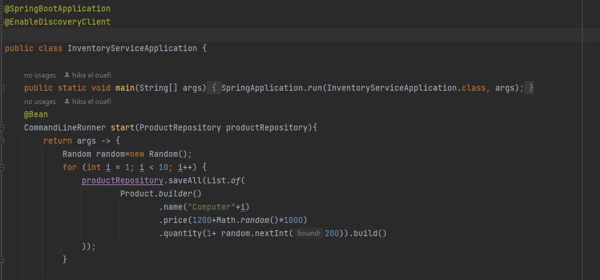
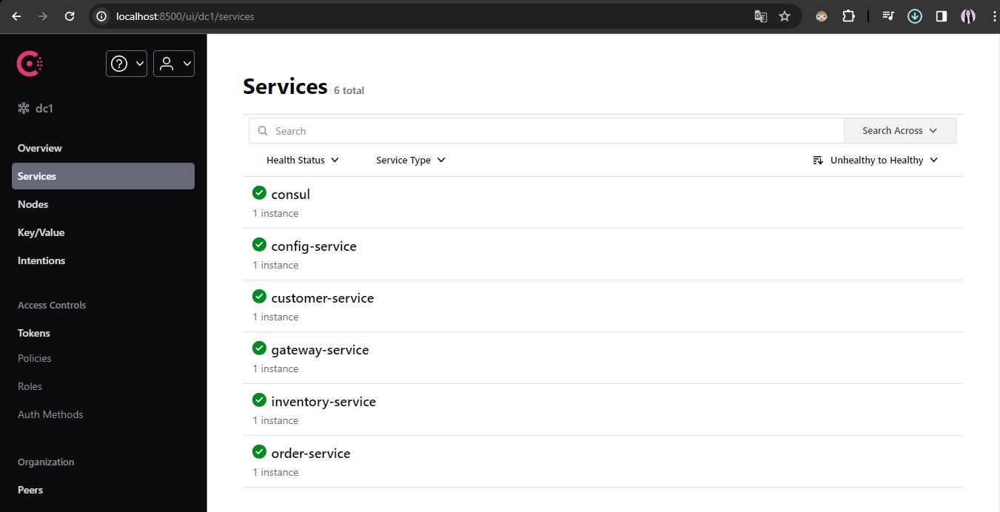
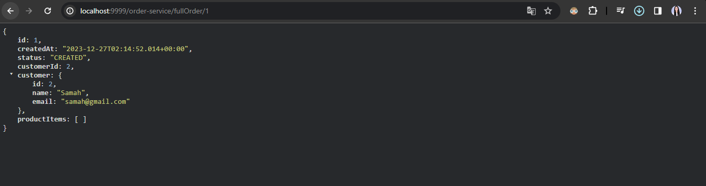
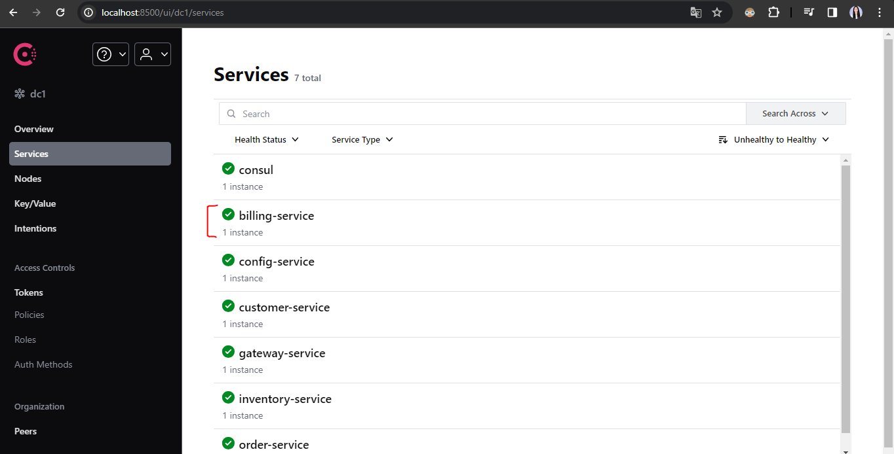
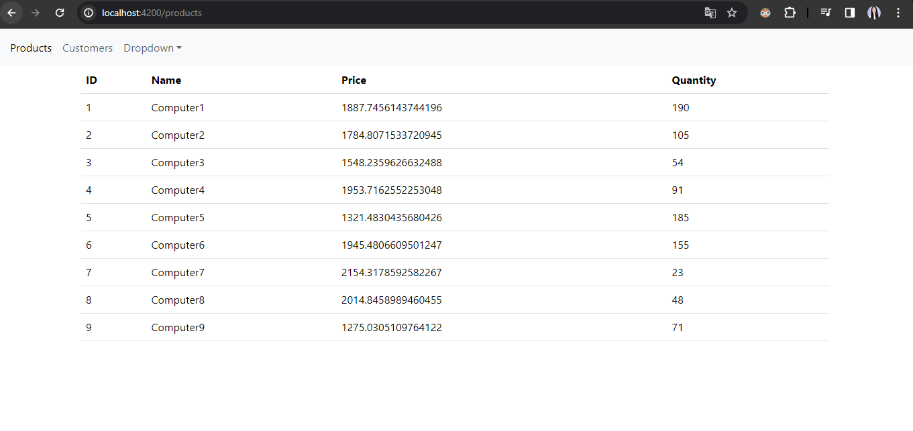

# Objectif :
Créer une application de e-commerce basée sur les micro services :
1. Consul Discovery
2. Spring Cloud Config
3. Spring Cloud Gateway
4. Customer-service
5. Inventory Service
6. Order Service
7. Consul Config (Billing Service)
8. Vault (Billing Service)
# Architecture:

# screens
## On Commence par la Configuration du service config:
### consul cmd:
- ipconfig
- consul agent -server -bootstrap-expect=1 -data-dir=consul-data -ui -bind=@

# visualisation de la configuration de chaque service:
### customer-service:

- environement def

- environement dev

- environement prod

### inventory-service:
- environement def

- environement dev

### application:

# liste des customers
- data base:

- la liste sans projection:

- la liste avec projection:

- la recherche d'un customer par id:

# Configuration dynamique de la Gateway:

# Configuration dynamique de Inventory-service:

- liste des produits sans projection:

- liste des produits avec projection:

# Configuration dynamique de Order-service:

- liste des commandes par client et produit:

- Affichage d'une commande compète(client,produit):

7. Configuration de Billing Service:
# avec consul config:
- Creation d'un repertoire config billing-service:

# avec Vault:
#### vault command:
- vault server -dev
-  set VAULT_ADDR=http://127.0.0.1:8200
- vault kv put secret/billing-service user.username=hiba user.pssword=123456
- vault kv get secret/billing-service

7. Frontend Web avec Angular:
###### Run app: ng serve
###### Installing bootstrap:  npm install -save bootstrap bootstrap-icons
###### Add this to "angular.json" :
-  "node_modules/bootstrap/dist/css/bootstrap.min.css"
-  "node_modules/bootstrap/dist/js/bootstrap.bundle.js"

# Screens:
- liste des produits:
  

- liste des clients:
  

